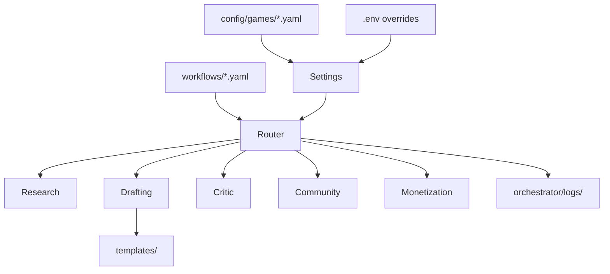

# Architecture

Creator Toolbox is a creator launch system: config, product modules, and a Python orchestrator that runs sequential workflows for content, community, and monetization. GTA 6 is the first target; the layout stays game-agnostic via YAML config.

## System goals

- Run repeatable launch pipelines without rebuilding tooling per game.
- Keep IP safety and dry-run defaults in the orchestrator, not in operator memory.
- Ship local-first: tests and workflows run offline with stubbed integrations.
- Document product tracks (scripts, RP server, NPC packs, content engine) in one repo.

## Design principles

- **Supervisor + sequential pipeline**: one router runs steps in order. No uncontrolled agent swarms.
- **Bounded critic loops**: IP review runs at defined steps, not in open-ended retry loops.
- **Config over code**: game facts, channels, and safety rules live in `config/games/`.
- **Explicit stubs**: publish and queue steps record intent; they do not pretend to hit live APIs in this pass.
- **Small modules**: agents do one job and write structured artifacts for the next step.

## Layered architecture

### Config layer

- `config/games/*.yaml` — slug, platforms, sources, IP rules, channels, monetization categories.
- `.env` — secrets and optional overrides (`GAME_SLUG`, `RELEASE_DATE`).

### Module layer

Product and ops scaffolds that workflows and humans use:

- `scripts/` — FiveM script catalog and specs
- `servers/` — RP server design and content pipeline
- `npc-packs/` — AI NPC pack engine and configs
- `templates/` — parameterized markdown scaffolds
- `playbooks/` — shipping cadence and KPIs per business track
- `content/` — calendar and research notes

### Orchestrator layer

- `models.py` — `GameConfig`, `Settings`, `WorkflowDefinition`, `AgentResult`, `RunLogEntry`
- `settings.py` — load game config and env
- `router.py` — load YAML workflows, execute steps, retries, run summary
- `agents/` — research, drafting, critic, community, monetization
- `workflows/*.yaml` — declarative step lists

### Interface layer

- CLI: `python -m orchestrator --list`, `python -m orchestrator gta6_news_drop`
- JSON run logs in `orchestrator/logs/` when `--log` is set
- Draft output to `output/` when `--out` is set



## Agent roles

| Agent | Role |
|-------|------|
| research | Build structured research placeholders from game config and payload facts |
| drafting | Render a template into `artifacts.drafts[step_id]` |
| critic | Block outputs that violate `ip_safety` rules |
| community | Queue Discord, YouTube, email, or social actions (stubbed) |
| monetization | Attach monetization suggestions by content type |

## Workflow execution model

1. Router loads a workflow by name from YAML.
2. Each step specifies `id`, `agent`, and agent-specific fields (`template`, `review_step`, `action`, etc.).
3. Agents read/write shared `RunState` (`artifacts`, `blocked`, `steps`).
4. If critic blocks, later community/monetization steps still run but record `skipped` where appropriate.
5. Run ends with `artifacts.summary` and optional JSON log file.

## Retry and failure semantics

- Steps may set `retries: N`. The router re-runs on `error` status up to N times.
- Uncaught exceptions become `error` results and are logged.
- `blocked` is terminal for publish intent but does not halt the audit trail.

## Human-in-the-loop approvals

Steps with `requires_approval: true` skip unless the run payload includes `approved: true`. Use this for launch posts or paid promos before live integrations exist.

## Observability and logging

- Each step produces an `AgentResult` with status and message.
- `--log` writes a timestamped JSON file under `orchestrator/logs/`.
- CLI prints `artifacts.summary` as JSON on stdout.

## Security and IP safety

- No secrets in the repo; use `.env` (gitignored).
- Critic enforces per-game `ip_safety.banned_patterns` when `forbid_leaks` is true.
- Docs and templates use confirmed sources only; speculation is labeled.
- Do not reference leaked builds, datamined assets, or re-hosted Rockstar art.

## Directory tree

```text
Creator-toolbox/
  config/games/gta6.yaml
  docs/
  templates/content|community|monetization/
  orchestrator/
    models.py settings.py router.py utils.py
    agents/ workflows/*.yaml logs/
  scripts/ servers/ npc-packs/ playbooks/ content/
  tests/ .github/
```

## Future roadmap notes

- Phase 2+: real Discord/YouTube/email adapters behind the community agent.
- Optional approval UI or CLI prompt for `requires_approval` steps.
- Analytics agent and KPI ingestion from platform APIs.
- Additional game configs by copying `gta6.yaml` pattern.
